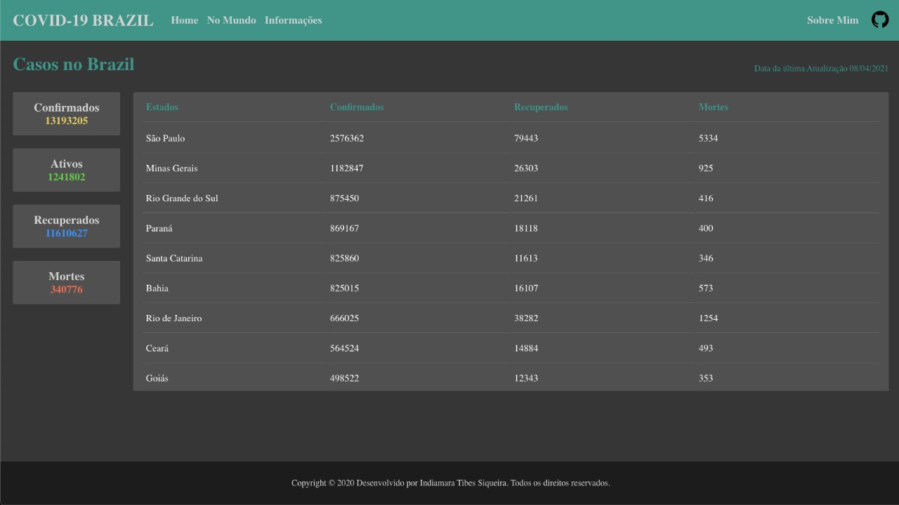
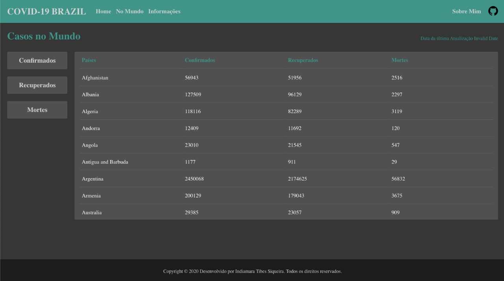
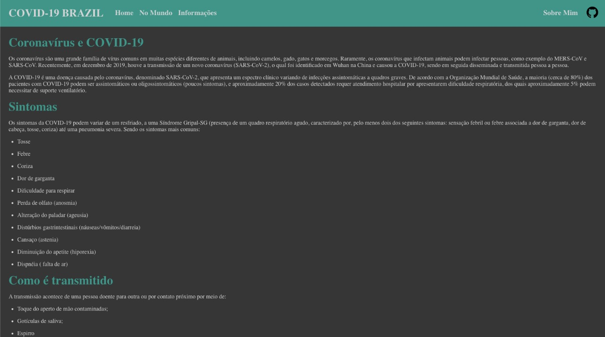
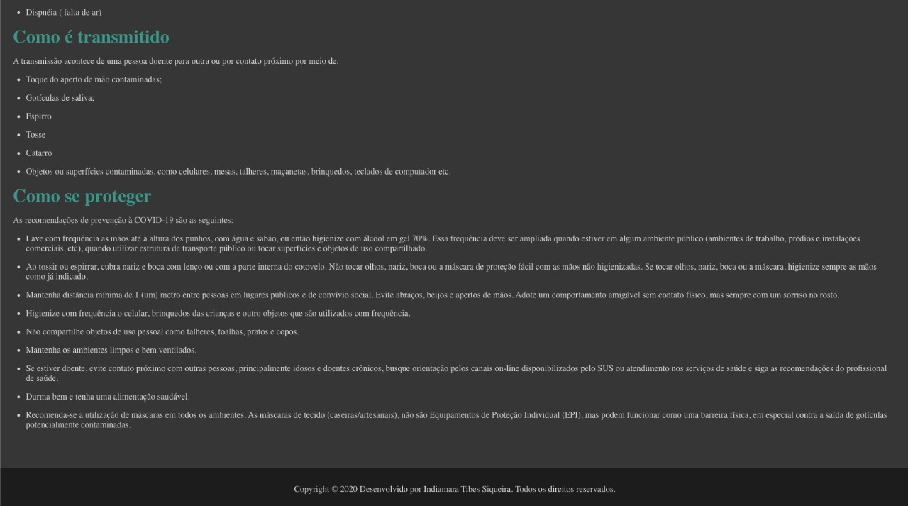

<h1 align="center">
  
</h1>

## 🚀 Tecnologias

Esse projeto foi desenvolvido com as seguintes tecnologias:

- React JS
- Styled Components
- Api REST

## 💻 Projeto

O Projeto Covid-19 é um site onde visa mostrar as estimativas dos casos registrados de covid no Brazil e no mundo. 
O objetivo do mesmo é apenas de aprendizado das tecnologias na área de tecnologia. Aprimorando e desenvolvendo meus conhecimentos.

## API usadas

Nesse projeto foi utilizado duas fontes de Api distintas.

Link do GitHub do Arthur Ribeiro [clique aqui.](https://github.com/devarthurribeiro/covid19-brazil-api)

Link do GitHub do Rodrigo Pombo [clique aqui.](https://github.com/pomber/covid19)

## Hospedado na vercel.

Acesse o site para melhor visualizar o projeto! [clique aqui!!](https://covid-tawny.vercel.app/)

## Layout 

Layout 100% responsivo...

<h1>
  
</h1>

<h1>
  
</h1>

<h1>
  
</h1>

<h1>
  
</h1>

## Desenvolvido 

Feito com ♥ by Indiamara Tibes Siqueira [Acesse meu Linkedin!](https://www.linkedin.com/in/indiamara-tibes-siqueira)
